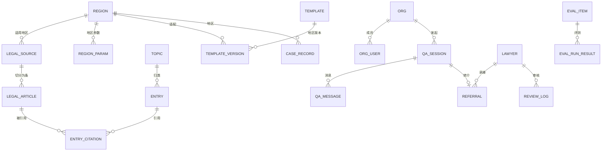

# 劳动法智能百科与问答 Agent — 产品需求文档（PRD）

| 项目 | 内容 |
|---|---|
| 产品代号 | LDLAWQ（正式名称待定） |
| 版本 | v0.1.1 评审稿（更新：数据库选型 SQLite） |
| 日期 | 2026-06-10 |
| 状态 | 待合作律师 / 律协评审 |
| 读者 | 创始团队、合作律师与律协、研发团队 |

> 文中涉及的具体地方性规定名称、天数、金额标准，除标注「已核实」外均为示例框架，**以法规入库时逐条核实为准**。这条规矩本身就是本产品的第一原则。

---

## 1. 背景与机会

- 企业人事（HR）在招聘入职、在职管理、解除终止、工伤争议等环节高频遇到劳动法问题，目前的解决方式是查百度 / 问通用 AI / 咨询律师，前两者**不准**，后者**贵且慢**。
- 与合作律师沟通确认：HR 咨询是律师事务所最常见的零散需求来源，但单次咨询客单价低，律师没有动力精细服务，需求大量流失。
- 通用 AI（ChatGPT / 豆包 / DeepSeek 等）回答劳动法问题的三个系统性缺陷：
  1. **凭训练记忆作答**：编造条款号、混淆新旧规定；
  2. **没有地区意识**：劳动法实操高度地方化（病假工资、产假天数、补偿基数封顶、高温津贴等各省市不同），通用 AI 给「全国平均答案」；
  3. **计算不可靠**：N / N+1 / 2N、分段计算、封顶规则等心算经常出错，而 HR 的问题恰恰多是算钱。
- 机会：做一个**答案可信、地区精准、拿来即用**的劳动法工具，通过律师协会渠道分发——律师是业务员，也是质量审核者，也是疑难案件的承接者。

## 2. 产品定位与商业模式

### 2.1 一句话定位

面向企业 HR 的劳动法智能工作台：**百科词条 + 问答 Agent + 计算器 + 文书模板 + 案例库**，每个答案带法条原文引用，拿不准的转给真律师。

### 2.2 目标用户

| 用户 | 角色 | 核心诉求 |
|---|---|---|
| 企业 HR / 人事专员 | 主用户 | 快、准、可执行：要结论、要依据、要能下载的文书 |
| HRBP / 人力总监 | 主用户 | 合规风险预判、向老板解释依据 |
| 中小企业老板 / 行政兼人事 | 主用户 | 不懂法，需要白话解释 + 操作步骤 |
| 合作律师 | 渠道 + 供给 | 获客（案源转介）、低成本维护客户关系 |
| 律师协会 | 渠道 | 会员服务创新、行业形象 |

### 2.3 商业模式

```
律协背书 → 律师向服务的企业推广 → 企业订阅（年费 SaaS）
                                      ↓
                  AI 解决 80% 标准问题（订阅价值）
                                      ↓
                  20% 疑难个案一键转律师（律师的案源回报）
                                      ↓
                  律师审核词条 / 模板（内容供给，署名曝光）
```

- 收入：企业年费订阅（按规模 / 席位，定价待测试）；渠道律师分成（比例与合规方式待律协确认，见 §12 开放问题）。
- 律师的三重激励：案源转介、审核署名（个人品牌曝光给区域内所有订阅企业）、维护既有企业客户的低成本工具。
- 冷启动路径：1 家律协试点 → 首批 10–20 名审核律师 → 律师各自带 3–5 家企业客户试用。

## 3. 首发地区与覆盖范围

首发覆盖三大经济圈、8 个司法辖区维度：

| 区域 | 行政层级 | 备注 |
|---|---|---|
| 上海 | 省级（直辖市） | 经济补偿历史分段口径等本地特色规则多 |
| 江苏 | 省级 | 有省劳动合同条例；苏州、南京市级细则二期评估 |
| 浙江 | 省级 | 杭州、宁波市级细则二期评估 |
| 北京 | 省级（直辖市） | 最低工资口径等本地特色规则 |
| 天津 | 省级（直辖市） | |
| 河北 | 省级 | 京津冀一体化配套，体量小但补齐区域完整性 |
| 广东 | 省级 | 省工资支付条例；广州按省 + 市两级 |
| 深圳 | **市级，单列** | 经济特区立法权，特区法规与广东省规定并行且常有差异，必须独立建库 |

数据分三层：**L0 国家层**（全部地区共用）→ **L1 省级层**（7 省市）→ **L2 市级层**（广州、深圳；深圳含特区法规）。每个回答按「国家层 + 用户所在省 + 用户所在市」三层叠加检索。

## 4. 核心使用场景（User Stories）

按员工生命周期组织，也是百科的一级目录：

1. **招聘入职**：offer 能否撤回？试用期最长多久、工资下限？背调边界？
2. **劳动合同**：必备条款？不签书面合同的二倍工资风险？无固定期限合同触发条件？
3. **工时与加班**：加班费基数与倍率？调休能否替代加班费？综合工时 / 不定时审批？
4. **休息休假**：年假天数与未休折算？病假医疗期与病假工资？产假 / 陪产假 / 育儿假（地区差异最大的主题之一）？
5. **工资与福利**：工资支付周期与代扣规则？高温津贴？年终奖离职是否要发？
6. **社保公积金**：漏缴补缴？不缴的法律后果？基数合规？
7. **规章制度**：怎样制定才有效（民主程序 + 公示）？员工手册签收？
8. **调岗调薪**：单方调岗的合法边界？降薪操作？
9. **解除与终止**：协商解除、过失性辞退、无过失性辞退、经济性裁员的程序与成本对比；离职证明义务。
10. **经济补偿与赔偿**：N、N+1、2N 的适用情形与计算（最高频问题，没有之一）。
11. **竞业限制与保密**：适用人群、补偿标准、违约金。
12. **女职工与三期**：孕期产期哺乳期的调岗 / 解除限制。
13. **工伤**：认定流程、待遇构成、私了协议风险。
14. **劳动争议**：仲裁时效、应诉准备、证据清单。

典型 Story 示例：

> 作为一名苏州制造业 HR，我要与一名工作 3 年 7 个月、月薪 8,500 元的员工协商解除，我希望 3 分钟内得到：补偿金额计算、协商解除协议模板（江苏适用版）、谈话注意事项、本地类似案例，以及如果谈崩了的风险预案。

## 5. 功能需求总览

| 编号 | 模块 | 一句话说明 | 优先级 | 首发里程碑 |
|---|---|---|---|---|
| F1 | 智能问答 Agent | 对话式咨询，带引用、带拒答、带转律师 | P0 | M0 |
| F2 | 百科词条库 | 主题 × 地区结构化词条，律师审核署名 | P0 | M0 |
| F3 | 计算器套件 | 补偿金 / 加班费 / 年假等确定性计算 | P0 | M0 |
| F4 | 法律文书模板库 | 分地区版本、可下载、带风险批注 | P0 | M1 |
| F5 | 案例库 | 可检索、可下载的裁判案例与官方典型案例 | P0 | M1 |
| F6 | 转律师与案源分发 | 拒答 / 主动咨询 → 匹配合作律师 | P0 | M1 |
| F7 | 律师内容后台 | 词条 / 模板 / 案例 / 参数的审核工作流 | P1 | M2 |
| F8 | 企业管理端 | 账号席位、用量统计、订阅管理 | P1 | M2 |
| F9 | 法规更新监测 | 官方源监测 → 影响分析 → 复审队列 | P1 | M1 脚本化 → M2 产品化 |

终端形态：Web（企业端主入口）+ 微信小程序（HR 日常高频入口）+ 律师端 H5 / 小程序（接单与审核）。M0 仅 Web。

## 6. 功能详述

### F1 智能问答 Agent（P0）

**流程**（详见 §7 可信管线）：

1. **要素确认**：识别问题后先补全四要素——用工所在地（精确到市）、工龄、月薪（涉钱时）、具体情形。已绑定企业默认地区，可单次覆盖。
2. **路由**，按优先级：
   - ① 命中已审核词条 → 直接返回词条内容（零生成风险）；
   - ② 计算类意图 → 调起对应计算器，对话内收集参数并出结果；
   - ③ 开放问题 → 知识库检索生成（RAG），只依据检索到的条文；
   - ④ 依据不足 / 个案争议 / 超出范围 → 拒答 + 转律师入口。
3. **统一输出格式**（每条回答）：

```
【结论】       一句话直接回答
【依据】       法条原文摘录，标注法规名 + 条号，可点开全文
【地区适用】   本回答适用于：上海（国家层 + 上海层依据）
【计算过程】   （涉钱时）计算器明细，参数可改
【风险提示】   常见操作误区、举证要点
【相关资源】   关联词条 / 文书模板下载 / 类似案例
【免责】       仅供参考，不构成法律意见 ｜ [咨询合作律师 →]
```

- 多轮对话：支持追问、改参数重算、切换地区对比（「如果这个员工在深圳呢？」）。
- 每轮回答带「有用 / 没用」反馈，负反馈进入律师抽检队列。

**验收要点**：编造引用 = 0（硬门槛）；要素不全时必须追问而不是假设；地区错配 = P0 缺陷。

### F2 百科词条库（P0）

- **组织方式**：主题（§4 的 14 类）× 地区 矩阵。一个词条 = 一个问题在一个地区范围内的标准答案。
- **词条内容模板**（结构化字段，见附录 C）：白话结论 / 法律依据（条文摘录）/ 地区差异对照表 / HR 操作指引（步骤化）/ 常见误区 / 关联模板·案例·计算器 / 审核信息。
- **审核与时效**：
  - 每个词条发布前须由执业律师审核并署名（姓名 + 律所 + 执业证号），界面展示「✓ 某某律师已审核 · 2026-06」；
  - 每个词条带 `依据版本日期` 和 `复审到期日`（默认 12 个月，法规变更时立即触发复审）；
  - 过期未复审的词条降级显示「依据可能更新，建议确认」。
- 入口：分类浏览、站内搜索、问答 Agent 命中跳转。
- 首批规模：M0 交付 TOP 20 高频问题 ×（上海 + 江苏）；M1 扩至 100+ 词条 × 江浙沪；M2 扩至 300+ × 全部 8 地区。

### F3 计算器套件（P0）

原则：**所有涉钱的高频问题用代码算，不用模型算**。AI 只负责对话收集参数和解释结果。

| 计算器 | 关键规则点 | 地区参数依赖 | 里程碑 |
|---|---|---|---|
| 经济补偿金 | N 的折算（满半年按 1 年、不满半年按 0.5）、月工资口径（应发，前 12 个月平均）、高薪 3 倍社平封顶 + 12 年封顶、2008 年前后分段（上海等地口径差异） | 各地上年度社平工资 | M0 |
| 违法解除赔偿金 | 2N 与 N 的关系、不并存 | 同上 | M0 |
| 年休假 | 累计工龄 5 / 10 / 15 天档、入离职当年折算、未休 300% 折算 | 无 | M0 |
| 加班费 | 基数确定（约定 vs 实际）、1.5 / 2 / 3 倍、调休限平时加班 | 部分地区基数规则（如深圳约定基数规则） | M1 |
| 病假工资 / 医疗期 | 医疗期 3–24 个月档位（劳部发〔1994〕479 号）、各地病假工资折扣与下限 | 各地病假工资规则 | M1 |
| 产假与生育津贴 | 国家 98 天 + 各省奖励假、津贴与工资差额补足 | 各省计生条例 | M1 |
| 试用期合法性 | 期限上限与合同期联动、工资下限 80% | 无 | M1 |
| 竞业限制补偿 | 月平均工资 30% 与当地最低工资孰高（司法解释口径） | 各地最低工资 | M1 |
| 法定退休年龄 | 渐进式延迟退休（2025-01-01 起施行）逐月测算 | 无 | M2 |
| 工伤待遇估算 | 伤残等级 × 待遇构成 | 各地统筹规则 | M2 |

- 每个计算器输出：结果 + 分步明细 + 每一步引用的依据 + 「哪些情况不适用本计算器」的边界声明。
- 计算规则配置化（见 §8 `calculator` + `region_param` 表），参数年度更新（社平工资、最低工资），更新需律师确认后生效。
- 每个计算器关联一个解释词条，结果页可下载计算明细（PDF，盖「测算仅供参考」水印）。

### F4 法律文书模板库（P0，用户点名需求）

- **分类与首批清单**（约 45 份，详见附录 E）：
  - 入职类：劳动合同（全日制 / 非全日制）、offer、入职登记表、保密协议、竞业限制协议、培训服务期协议；
  - 在职类：调岗通知书、调薪确认书、续签意向征询、考勤与加班审批单、年假申请与统筹安排通知；
  - 制度类：员工手册（框架版）、考勤制度、薪酬制度、民主程序会议记录模板、制度签收单；
  - 离职类：协商解除协议、解除 / 终止劳动合同通知书、辞退通知（严重违纪版）、不续签通知、离职证明、工作交接单、离职结算单；
  - 争议应对类：仲裁答辩要点清单、证据清单模板、送达地址确认书；
  - 特殊情形类：三期员工沟通函、医疗期满通知、竞业限制启动 / 豁免通知。
- **每份模板的产品要求**：
  1. **地区版本**：同一模板按地区出适配版（如劳动合同的必备条款与本地备案要求差异），无差异地区共用「通用版」；
  2. **风险批注**：模板内嵌律师批注（哪些条款不能删、常见无效约定、签署注意事项），下载版保留批注页；
  3. **填写指引**：逐字段说明 + 示例；
  4. **审核署名与版本号**：同词条机制，法规变更触发模板复审；
  5. **格式**：docx 下载（保留批注），在线预览（PDF 渲染）；
  6. 下载行为计入 `download_count`（运营数据 + 付费墙依据：免费用户每月限 N 份，订阅不限）。
- 二期（M3）：对话式智能填充——问答中收集的要素直接生成已填好的定制文书。

### F5 案例库（P0，用户点名需求）

- **数据来源（合规三渠道，禁止违规爬取裁判文书网）**：
  1. 官方公开：最高法指导性案例、各地法院 / 人社部门发布的劳动争议典型案例、白皮书附案例（免费、权威，首选）；
  2. 商业授权：法律数据库厂商采购裁判文书授权（M1 启动选型与谈判）；
  3. 律师贡献：合作律师提供本所经办案例的**脱敏版**，署名展示（激励之一）。
- **结构化字段**：案号、法院、地区、审级、案由、争议焦点标签、基本案情摘要、裁判要旨、裁判结果（用人单位胜 / 败 / 部分支持）、引用法条、判决日期、来源渠道与授权说明、脱敏状态。
- **检索**：按主题 / 地区 / 争议焦点 / 结果筛选；语义搜索（「类似我这个情况的判例」）。
- **与其他模块联动**：词条尾部挂「本地类似案例」；问答回答的【相关资源】推荐案例；案例页反链词条。
- **下载**：案例摘要卡（PDF，单页：焦点 + 要旨 + 结果 + 法条）+ 原文（有授权时提供，无授权提供官方来源链接）。
- 首批规模：M1 交付 300+（以官方典型案例为主，覆盖江浙沪 × 高频主题）；M2 扩至 1,000+。
- **用途分层**：给 HR 看摘要卡（风险沟通素材，「类似案子公司赔了多少」），给律师看全文。

### F6 转律师与案源分发（P0）

- **触发场景**：① Agent 拒答时自动推荐；② 每条回答尾部常驻「咨询合作律师」；③ 用户浏览词条 / 案例时主动点击。
- **流程**：
  1. 系统自动生成**咨询摘要**（问题 + 已收集要素，脱敏）；
  2. 用户确认并**授权**将摘要转交律师（PIPL 要求，单独勾选）；
  3. 按 地区 → 专长 → 接单状态 → 评分 匹配律师，推送至律师端；
  4. 律师 2 小时内接单（超时流转下一位），以电话 / 微信 / 平台留言完成首次响应；
  5. 工单闭环记录（接单、首响、结案、企业评价），作为分成结算与律师评级依据。
- 后续成案（代理、常年顾问）在平台外签约，平台只记录转介关系（分成口径与合规方式见 §12）。
- 律师端（M1 用 H5 最简版）：接单台、我的案源、我审核的内容、我的署名词条数据（被浏览次数——给律师的「成就感仪表盘」）。

### F7 律师内容后台（P1）

- 词条 / 模板 / 案例 / 地区参数 四类对象统一的「提交 → 审核 → 发布 → 复审」工作流；
- 审核任务派发：按律师的地区与专长自动分配，带截止时间；
- 复审队列：法规更新监测（F9）触发的待复审对象列表；
- 全量审核留痕（谁、何时、改了什么、依据什么），见 §8 `review_log`。
- M0/M1 阶段用简化方案过渡：Notion / 飞书多维表格管理内容生产，脚本同步入库。

### F8 企业管理端（P1）

- 企业账号开通（绑定渠道律师 ID，分成归因）、席位管理、用量报表（提问数、下载数、转律师数）；
- 订阅与续费；发票信息。

### F9 法规更新监测（P1）

- 监测源：国家法律法规数据库（flk.npc.gov.cn）、人社部、最高法、8 个地区的人社厅（局）与人大官网发布页；
- 每日抓取 → 新文件进 `watch_task` 队列 → 运营初筛 → 关联影响分析（该文件涉及哪些词条 / 模板 / 参数）→ 生成复审任务派发律师；
- 社平工资 / 最低工资等参数有固定发布日历，按日历主动盯防。

## 7. 可信问答管线（核心质量机制）

这是产品的命门，单独成章。六道防线：

1. **封闭知识库**：模型只允许依据检索结果作答，知识库外的问题一律拒答。系统提示词层面禁止使用参数化记忆里的法条。
2. **三层地区过滤**：检索范围 = L0 国家层 + 用户所在省 L1 + 所在市 L2，其他地区的地方规定物理隔离，从源头杜绝「拿深圳的规定答上海的问题」。
3. **强制引用 + 机器校验**（生成后、展示前）：
   - 引用存在性校验：回答中的（法规名，条号）必须能在 `legal_article` 表精确匹配；
   - 引用一致性校验：回答摘录的条文与库内原文逐字比对；
   - 数字溯源校验：回答中出现的所有数字，必须来自引用条文原文或计算器输出，否则拦截；
   - 任一校验不过 → 不展示，自动降级为拒答 + 转律师。
4. **确定性计算**：涉钱一律走计算器（F3），模型不做算术。
5. **置信度闸门**：检索相关度、校验通过情况、问题类型综合打分，低于阈值 → 标准话术拒答：「这个问题依据不足 / 属于个案争议，建议咨询律师」+ 一键转介。**宁可拒答，不可硬答。**
6. **律师审核飞轮**：`qa_log` 中高频出现、当前走 RAG 路径的问题，按周聚类生成「待沉淀词条」清单 → 律师审核 → 转为词条路径（零生成风险）。目标：词条命中率随运营时间持续上升（北极星指标之一）。

**底层模型选型约束**：境内对外服务 + 用户输入含企业与员工个人信息 → 必须使用已完成备案的境内大模型（如 DeepSeek / 通义 / 智谱等，选型测试后定）或私有化部署；不依赖境外 API。模型层设计为可替换（接口抽象），评测集（§10）作为换模型的回归依据。

## 8. 数据库设计

### 8.1 技术选型

- **SQLite 3.45+**：主库。单文件、零运维、可嵌入，适配 M0–M1 单机部署形态，也天然支持后续私有化交付。
  - 向量检索：`sqlite-vec` 扩展（vec0 虚拟表，存法条 / 词条 / 案例 embedding，KNN 查询）；
  - 全文检索：FTS5 + 中文分词 tokenizer（simple / cppjieba 方案，选型时实测召回）；
  - JSON：TEXT 存储 + 内置 json_* 函数（3.45+ 支持 JSONB 二进制格式），关键 JSON 列加 `json_valid()` CHECK。
- **双库架构（核心设计）**：
  - `knowledge.db`——法规、法条、词条、模板元数据、案例、地区参数，以及全部向量与 FTS 虚拟表。**运行时只读**；内容发布 = 内容管线侧构建新库文件后整体替换，天然获得版本化、秒级回滚（换回旧文件）、离线分发能力；
  - `app.db`——企业、用户、问答日志、转介工单、订阅、审核流水、评测。读写库，WAL 模式。
  - 读写分离后，知识检索与业务写入互不争锁，规避 SQLite 单写者瓶颈。
- **运行参数（写进部署基线）**：`journal_mode=WAL`、`foreign_keys=ON`、`busy_timeout=5000`、`synchronous=NORMAL`；应用层将 app.db 的全部写操作收敛到单写队列。
- **备份**：app.db 用 Litestream 流式备份至 OSS（分钟级 RPO）+ 每日快照，上线前演练恢复；knowledge.db 本身就是版本化构建产物，全部历史版本存 OSS。
- **对象存储（阿里云 OSS）**：文书模板文件、案例原文、计算明细 PDF——文件不进库，库内只存 file_key。
- **Redis 首期不引入**：会话与限流走进程内存 + app.db，压低部署复杂度。
- **可移植性约束**：用 ORM（Drizzle / SQLAlchemy 择一）管理 schema 与迁移，DDL 避免方言特性，逻辑模型与 PostgreSQL 保持兼容。
- **迁移触发条件（写进运维手册，M2 商用前压测复核）**：应用需要多实例水平扩展、app.db 写并发持续打满单写队列、或需要数据库层行级权限时，评估将 app.db 迁移 PostgreSQL——knowledge.db 的只读分发模式可长期保留。

**类型映射约定**（§8.3 表结构按此落地）：

| 逻辑类型 | SQLite 实现 |
|---|---|
| 主键 | INTEGER PRIMARY KEY |
| 枚举 | TEXT + CHECK 约束 |
| JSON | TEXT（JSON）+ json_valid() CHECK |
| 数组 / 多对多 | 关联表（清单见 §8.3 末尾）；低频小字段用 JSON 数组 |
| embedding | 不入主表，统一进 sqlite-vec 虚拟表（vec_article / vec_entry / vec_case） |
| 日期 / 时间 | TEXT，ISO 8601（UTC） |
| 布尔 | INTEGER（0 / 1） |

### 8.2 ER 总览



> 图为逻辑模型；M:N 关系在物理层落为关联表（清单见 §8.3 末尾），图中省略。

### 8.3 核心表结构

**region 地区表**

| 字段 | 类型 | 说明 |
|---|---|---|
| id | INTEGER PK | |
| code | TEXT | 行政区划码（GB/T 2260），国家层用 `CN` |
| name | TEXT | 中国 / 上海市 / 江苏省 / 深圳市… |
| level | TEXT + CHECK | country / province / city |
| parent_id | INTEGER FK→region | 深圳 → 广东 |

**legal_source 法规文件表**（知识库的根）

| 字段 | 类型 | 说明 |
|---|---|---|
| id | INTEGER PK | |
| title | TEXT | 《中华人民共和国劳动合同法》 |
| doc_no | TEXT | 文号，如 法释〔2020〕26 号 |
| issuer | TEXT | 发布机关 |
| level | TEXT + CHECK | law / admin_reg / judicial_interp / dept_rule / local_reg / local_rule / normative_doc（效力层级，冲突时排序依据） |
| region_id | INTEGER FK | 适用地区（国家层 = CN） |
| publish_date / effective_date / expire_date | TEXT（ISO） | |
| status | TEXT + CHECK | active / revised / repealed |
| full_text | TEXT | 全文 |
| source_url | TEXT | 官方来源链接（溯源） |
| version / prev_version_id | INTEGER / FK | **保留历史版本**——分段计算等「时点法」问题必须能取到旧版条文 |

**legal_article 法条表**（引用校验的基准）

| 字段 | 类型 | 说明 |
|---|---|---|
| id | INTEGER PK | |
| source_id | INTEGER FK→legal_source | |
| article_no | TEXT | 第四十七条 |
| clause_no | TEXT | 款 / 项（可空） |
| text | TEXT | 条文原文（逐字，校验基准；同步进 fts_article 全文索引） |
| 主题标签 | 关联表 | article_topic（article_id, topic_id） |
| embedding | 外置 | sqlite-vec 虚拟表 vec_article，按 id 对齐 |
| status | TEXT + CHECK | 随 source 联动 |

**region_param 地区参数表**（计算器的数据源，年度更新）

| 字段 | 类型 | 说明 |
|---|---|---|
| id | INTEGER PK | |
| region_id | INTEGER FK | |
| param_key | TEXT | social_avg_wage / min_wage / high_temp_allowance / sick_pay_rule … |
| value | TEXT（JSON） | 数值或结构化规则 |
| period | TEXT | 适用年度 / 期间 |
| basis_source_id | INTEGER FK→legal_source | 该参数的依据文件 |
| effective_date / expire_date | TEXT（ISO） | |
| verified_by / verified_at | FK→lawyer / TEXT（ISO） | 律师确认后生效 |

**entry 词条表**

| 字段 | 类型 | 说明 |
|---|---|---|
| id | INTEGER PK | |
| title / slug | TEXT | |
| topic_id | INTEGER FK | |
| 适用地区 | 关联表 | entry_region（entry_id, region_id），检索时按地区过滤 |
| body | TEXT（JSON） | 结构化内容（附录 C 模板的各字段） |
| status | TEXT + CHECK | draft / in_review / published / needs_recheck / archived |
| version | INTEGER | |
| reviewed_by / reviewed_at | FK→lawyer / TEXT（ISO） | 署名审核 |
| basis_date | TEXT（ISO） | 依据版本日期（对外展示） |
| recheck_due | TEXT（ISO） | 复审到期日 |
| embedding | 外置 | sqlite-vec 虚拟表 vec_entry，按 id 对齐 |
| view_count | INTEGER | |

**entry_citation 词条引用表**：entry_id + article_id + quote_text + position（机器校验词条引用与原文一致）。

**template / template_version 文书模板表**

| 字段（version 表） | 类型 | 说明 |
|---|---|---|
| template_id | INTEGER FK | 模板主体（name、category、fill_guide、risk_notes） |
| region_id | INTEGER FK | 地区版本；通用版 region = CN |
| file_key | TEXT | OSS 路径（docx，含批注） |
| version / changelog | INTEGER / TEXT | |
| reviewed_by / published_at | FK→lawyer / TEXT（ISO） | 审核署名 |
| download_count | INTEGER | 运营与付费墙（计数写在 app.db 侧，避免写只读库） |

**case_record 案例表**

| 字段 | 类型 | 说明 |
|---|---|---|
| id | INTEGER PK | |
| case_no | TEXT | 案号（脱敏规则按来源渠道） |
| court / region_id / trial_level | TEXT / FK / TEXT | 法院、地区、审级 |
| cause | TEXT | 案由 |
| 争议焦点 | 关联表 | case_tag（case_id, tag_id），配 dispute_tag 字典表 |
| facts_summary / gist | TEXT | 案情摘要 / 裁判要旨（同步进 fts_case） |
| result | TEXT + CHECK | employer_win / employee_win / partial |
| 引用法条 | 关联表 | case_citation（case_id, article_id） |
| decided_date | TEXT（ISO） | |
| source_channel | TEXT + CHECK | official_release / licensed_db / partner_lawyer |
| license_note | TEXT | 授权说明（合规留痕） |
| anonymized | INTEGER（0/1） | |
| file_key | TEXT | 原文（有授权时） |
| embedding | 外置 | sqlite-vec 虚拟表 vec_case，「类似案例」检索 |

**calculator 计算器配置表**：key、name、input_schema（JSON）、rule_version、依赖的 param_key 列表（JSON 数组）、explainer_entry_id。计算逻辑在代码中，参数从 region_param 取。

**qa_session / qa_message 问答日志**（飞轮原料 + 审计）

| 字段（message 表） | 说明 |
|---|---|
| session_id / role / content | 全量留痕（个人信息按 §9 脱敏策略） |
| facts | 抽取的要素，JSON（region、tenure、salary、scenario） |
| route | entry_hit / calculator / rag / refuse |
| hit_entry_id / calculator_key | |
| citations | 引用清单 + 校验结果（JSON） |
| confidence | 置信度分 |
| feedback | up / down |
| escalated | 是否转律师 |

**lawyer 律师表**：name、license_no（执业证号）、firm、association（所属律协）、status、rating、署名词条统计；执业地区走关联表 lawyer_region（转介匹配要按地区索引筛选），specialties 用 JSON 数组。

**referral 转介工单表**：session_id、org_id、lawyer_id、question_brief（脱敏摘要）、consent_at（用户授权时间，PIPL 留痕）、status（pending / accepted / in_progress / closed / timeout）、first_response_at、outcome、fee_note。

**org / org_user / subscription**：企业、成员（手机号 + 微信 openid）、订阅（plan、seats、起止、channel_lawyer_id 渠道归因）。

**review_log 审核流水**：object_type（entry / template / case / param）、object_id、action（submit / approve / reject / recheck）、reviewer_id、comment、created_at。全量留痕，责任可追溯。

**watch_task 法规监测任务**：source、found_title、url、detected_at、status（new / triaged / ingested / dismissed）、linked_source_id、impact_object_ids（JSON 数组）。

**eval_item / eval_run 评测集**：question、region_id、topic_id、gold_answer、gold_citations、author_lawyer_id、difficulty；run 记录每次系统版本的总分、分主题得分（JSON）、**编造引用计数（必须为 0）**。

**关联表（多对多，两列复合主键 + 双向索引）**：`article_topic`（法条 × 主题）、`entry_region`（词条 × 适用地区）、`case_tag`（案例 × 争议焦点，配 dispute_tag 字典表）、`case_citation`（案例 × 引用法条）、`lawyer_region`（律师 × 执业地区）。前四张属 knowledge.db，lawyer_region 属 app.db。

**虚拟表（knowledge.db 构建脚本统一生成，与主表按 id 对齐）**：向量 `vec_article` / `vec_entry` / `vec_case`（sqlite-vec）；全文 `fts_article` / `fts_entry` / `fts_case`（FTS5 中文分词，external content 模式）。knowledge.db 只读、整库替换发布，因此**无需触发器同步**——每次内容发布全量重建索引，构建脚本中完成。

**库归属**：legal_source / legal_article / region / topic / region_param / entry / entry_citation / template / template_version / case_record 及上述关联表、虚拟表 → `knowledge.db`；org / org_user / subscription / qa_session / qa_message / lawyer / referral / review_log / watch_task / eval_item / eval_run / 下载计数 → `app.db`。

### 8.4 数据冷启动与更新管线

1. **法规文本**：从国家法律法规数据库（flk.npc.gov.cn）及各地人大 / 政府官网获取正式文本 → 脚本切条入 `legal_article` → 抽样人工校对（每部法规抽 10% 条文比对原文）；
2. **地区参数**：按附录 A 清单逐地区收集，每个参数必须挂 `basis_source_id`，律师确认后生效；
3. **词条 / 模板**：律师按模板生产 → 后台（过渡期飞书多维表格）→ 审核 → 发布；
4. **案例**：三渠道并行（§F5），入库即标注来源与授权；
5. **日常更新**：F9 监测 → watch_task → 影响分析（反查 entry_citation / region_param.basis）→ 复审任务 → 更新发布，全程 review_log 留痕。

## 9. 非功能需求

### 9.1 合规（上线前置条件）

| 事项 | 要求 | 时间点 |
|---|---|---|
| 生成式 AI 服务合规 | 《生成式人工智能服务管理暂行办法》：完成算法备案 / 安全评估；底层使用已备案境内模型 | M1 启动，M2 商用前完成 |
| 个人信息保护（PIPL） | 咨询内容含员工个人信息：最小化收集、日志脱敏（姓名 / 身份证号自动打码）、转律师单独授权并留痕、企业数据逻辑隔离 | M1 |
| 免责声明 | 全局 + 每条回答：「内容仅供参考，不构成法律意见」；计算结果带「测算」水印 | M0 |
| 内容安全 | 敏感话题（群体性事件教唆等）拒答策略 | M1 |
| 律师执业合规 | 案源转介与分成模式不得违反律师执业管理规定——**方案由律协侧出具意见**（开放问题 §12） | M1 前 |
| 案例数据合规 | 仅用三合规渠道，不爬取裁判文书网；授权链路留痕 | 始终 |
| ICP / 等保 | ICP 备案；商用前等保二级评估 | M2 |

### 9.2 安全与性能

- 企业间数据隔离（org_id 行级隔离）；律师只能看到已授权转介的摘要；
- 问答首响 < 5 s，完整回答 < 15 s；计算器 < 1 s；可用性 99.5%；
- 全量问答日志保留 ≥ 3 年（争议追溯）。

## 10. 评测与验收标准

- **评测集**：合作律师出题，M0 ≥ 100 题、M1 ≥ 300 题，覆盖 主题 × 地区 × 难度（词条类 / 计算类 / 开放类 / 应拒答类），含金标准答案与金标准引用。
- **发版门槛（每次模型 / 提示词 / 知识库变更必须全量跑）**：

| 指标 | 门槛 | 性质 |
|---|---|---|
| 编造引用率（引用在库内不存在或与原文不一致） | = 0 | 硬门槛，出现即阻断发版 |
| 地区错配率（引了不适用地区的依据） | = 0 | 硬门槛 |
| 词条命中类准确率 | ≥ 98% | 目标值，与律师顾问定稿 |
| 计算类正确率（对照人工算） | 100% | 计算器是代码，错了修代码 |
| RAG 生成类关键结论正确率 | ≥ 92% | 目标值 |
| 应拒未拒率（该转律师却硬答） | ≤ 2% | 重点盯防 |
| 拒答率（整体） | 参考值 15–30% | 过低说明在硬答，过高说明库太薄 |

- **运营期抽检**：律师每周抽检 30 条真实问答（优先负反馈与低置信样本），抽检结果回流评测集。
- **北极星指标**：词条命中率（随飞轮上升）、企业周活跃 HR 数、转律师工单数（渠道价值证明）。

## 11. 里程碑与发布计划

| 里程碑 | 时间（2026） | 范围 | 验收物 |
|---|---|---|---|
| **M0 内部 Demo** | 6 月中 → 7 月底（6 周） | 上海 + 江苏；F1 问答管线（含六道防线）+ F2 词条 20 条 + F3 计算器 3 个（补偿 / 年假 / 赔偿金）；Web 端 | 评测集 100 题达门槛；给律协的现场演示 |
| **M1 试点版** | 8 月 → 9 月底（8 周） | 江浙沪全量；词条 100+、计算器 8 个、模板 40+、案例 300+；F6 转律师 MVP（H5）；F9 监测脚本；备案启动 | 5–10 家企业真实试用 4 周；评测 300 题达门槛；首批转介工单跑通 |
| **M2 商用版** | 10 月 → 12 月底 | + 京津冀、广东（广州 + 深圳特区库）；词条 300+、模板 80+、案例 1,000+；F7 律师后台、F8 企业端、小程序；计费上线 | 备案完成；首批付费企业；律协正式合作协议 |
| **M3** | 2027 H1 | 企业自有制度问答（上传员工手册按企业制度作答）、文书智能填充、HR SaaS 集成（北森 / Moka 等）、更多城市 L2 细化 | 按 M2 运营数据再定 |

## 12. 风险与开放问题

| # | 风险 / 开放问题 | 当前判断 | 责任方 |
|---|---|---|---|
| 1 | 案例数据获取：官方典型案例量是否足够支撑 M1 | 足够起步；商业授权 M1 并行谈 | 产品 |
| 2 | 律师审核激励是否可持续（审核是义务劳动？） | 设计署名曝光 + 案源优先权挂钩审核贡献；必要时付审核费 | 产品 + 律协 |
| 3 | 转介分成的执业合规口径 | **必须由律协 / 律师侧出具书面意见后再定产品方案** | 律协 |
| 4 | 算法备案周期不可控（2–6 个月） | M1 即启动；备案完成前控制为定向邀请制试用 | 产品 |
| 5 | 竞品：北大法宝 / 威科先行（法律人工具，HR 用不顺手）、51 社保类（社保代缴向）、通用 AI 助手（无地区深度无审核） | 差异化 = 地区参数深度 × 律师审核可信度 × HR 拿来即用（模板 / 计算器）× 转律师闭环 | — |
| 6 | AI 答错的责任边界（企业据此操作产生损失） | 免责声明 + 词条署名律师仅对词条版本负责（协议约定）+ 评估职业责任险 | 法务 |
| 7 | 正式产品名 / 品牌 | 待定，注册商标先行检索 | 创始团队 |
| 8 | 定价模型（按席位 / 按企业规模 / 按用量） | M1 试用期内 A/B 访谈定价 | 产品 |

## 附录 A：首发法规库清单框架

**L0 国家层（全地区共用，首批约 15 部）**：劳动法、劳动合同法及实施条例、社会保险法、劳动争议调解仲裁法、职工带薪年休假条例及实施办法、工伤保险条例、女职工劳动保护特别规定、工资支付暂行规定、企业职工患病或非因工负伤医疗期规定（劳部发〔1994〕479 号）、最高法劳动争议司法解释（一）（法释〔2020〕26 号）、关于实施渐进式延迟法定退休年龄的决定及配套办法、劳务派遣暂行规定、职工全年月平均工作时间和工资折算问题的通知。

**L1/L2 地方层（每地区按以下类目收集，名称以入库核实为准）**：工资支付条例（办法）、劳动合同条例（如有）、人口与计划生育条例（产假 / 育儿假）、工伤保险实施办法、医疗期与病假工资规定、高温津贴标准文件、本地仲裁 / 司法口径纪要（如有公开）、年度社平工资与最低工资公告。深圳另收：经济特区相关劳动法规（特区立法）。

## 附录 B：TOP 20 高频问题（首批词条）

1. 协商解除的经济补偿怎么算（N 的口径）｜2. N+1 到底什么情况才需要付｜3. 违法解除 2N 的认定与计算｜4. 试用期最长多久、工资下限、试用期能不能随时辞退｜5. 加班费基数怎么定、三种倍率、调休能否替代｜6. 年假天数与未休年假 300% 折算｜7. 医疗期有多长、病假工资怎么发｜8. 产假 / 陪产假 / 育儿假各多少天（地区差异）｜9. 三期女职工能否调岗、能否解除｜10. 不缴 / 漏缴社保的后果与补缴｜11. 未签书面劳动合同的二倍工资｜12. 无固定期限合同的触发条件｜13. 规章制度怎样才有效（民主程序 + 公示 + 签收）｜14. 单方调岗调薪的合法边界｜15. 严重违纪辞退的证据要求｜16. 合同到期不续签要不要给补偿｜17. 经济性裁员的程序｜18. 竞业限制的适用人群、补偿与违约金｜19. 工伤认定流程与待遇构成｜20. 仲裁时效与收到仲裁通知后的应对清单。

## 附录 C：词条内容模板（body 结构）

```json
{
  "conclusion": "白话结论（3 句话以内）",
  "legal_basis": [{"article_id": 0, "quote": "条文摘录", "note": "适用说明"}],
  "region_diff": [{"region": "上海", "rule": "…", "basis_article_id": 0}],
  "how_to": ["HR 操作步骤 1", "步骤 2（附时限与证据要求）"],
  "pitfalls": ["常见误区 1（如：协商解除也付 N+1——实际上 +1 仅适用于未提前 30 日通知的法定情形）"],
  "related": {"templates": [], "cases": [], "calculators": [], "entries": []},
  "review": {"lawyer_id": 0, "basis_date": "2026-06-01", "recheck_due": "2027-06-01"}
}
```

## 附录 D：问答输出样例（示意）

> **问**（上海某公司 HR）：员工 2023 年 6 月入职，月薪 15,000 元，现在想协商解除，要付多少补偿？需要 N+1 吗？
>
> **【结论】** 协商一致解除（公司提出）应支付经济补偿 N = 3 个月工资，按其离职前 12 个月平均应发工资计算；「+1」不是协商解除的法定义务（仅适用于医疗期满、不能胜任、客观情况重大变化三种情形下未提前 30 日书面通知时的代通知金），可作为谈判筹码而非义务。
>
> **【计算】** 2023-06 至 2026-06，工作满 3 年 → N = 3；3 × 15,000 = 45,000 元（前 12 个月平均应发口径，含奖金津贴；是否触发 3 倍社平封顶以当年度上海公布数核验——计算器自动判断）。
>
> **【依据】**《劳动合同法》第 36 条、第 46 条第（二）项、第 47 条、第 40 条（原文摘录可展开）。
>
> **【风险提示】** 协商解除协议应书面化并包含「双方再无其他争议」条款（模板见下）；补偿金个税按一次性补偿优惠口径处理。
>
> **【相关资源】** 📄 协商解除协议（上海版）下载 ｜ 📊 经济补偿计算器（改参数重算）｜ ⚖️ 本地类似案例 3 篇
>
> *内容仅供参考，不构成法律意见。把握不准？[咨询合作律师 →]*

## 附录 E：文书模板首批清单

见 §F4 分类，首批 45 份的完整明细清单（含每份的地区版本规划）在评审会上与律师逐份确认后冻结为 v1.0 范围。

---

*下一步：① 本 PRD 提交合作律师 / 律协评审，重点确认 §12 开放问题 3（分成合规）与评测门槛；② 评审通过后启动 M0 开发。*
